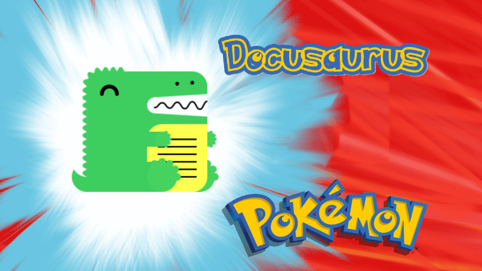
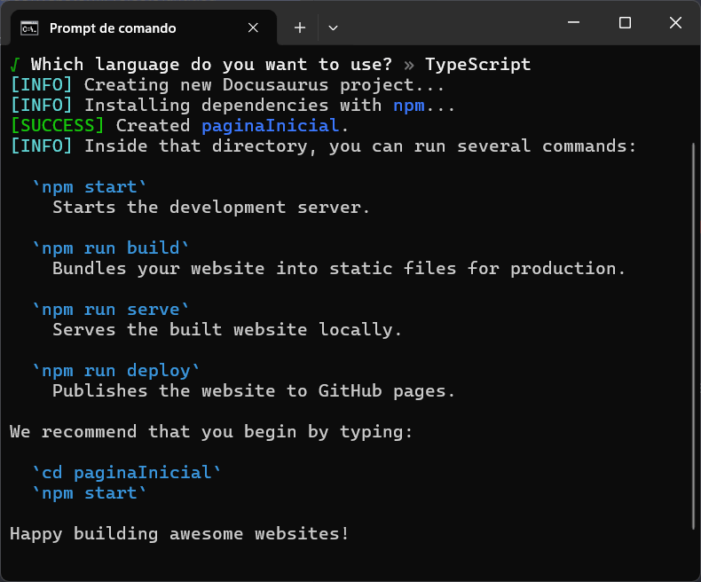
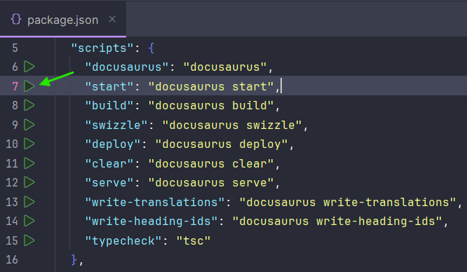
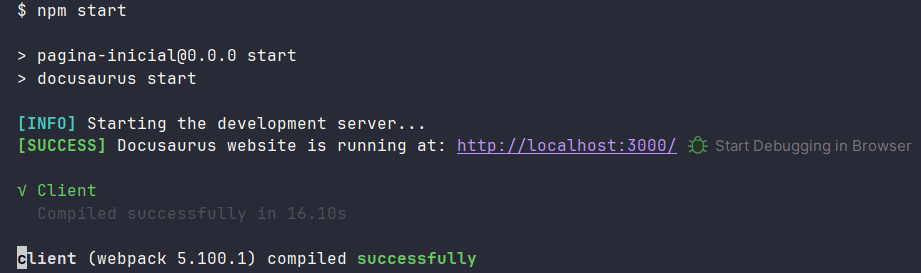

## Introdução

Tradução do site:
"🧐 O Docusaurus é um gerador de sites estáticos. Ele cria um SPA (Single Page Application) com navegação rápida do lado do cliente, aproveitando todo o poder do React para tornar seu site interativo. Ele oferece recursos de documentação prontos para uso, mas pode ser usado para criar qualquer tipo de site (site pessoal, produto, blog, landing pages de marketing, etc.)."

<!-- truncate -->



## Primeiros Passos

### Pré-requisitos

[Download do Node.js®](https://nodejs.org/pt/download/) -
v22.17.0 - binário de Node.js® pré-compilado

IDE - [WebStorm](https://www.jetbrains.com/pt-br/webstorm/download)

### Rodando o Tutorial Localmente

```bash
npx create-docusaurus@latest nome-projeto classic
```



mais info: https://docusaurus.io/docs/cli

```bash
npm start
```



Run 'start'



Sair "ctrl + c" ou "Stop 'start'"


## Considerações Finais


```js
return 20;
```
