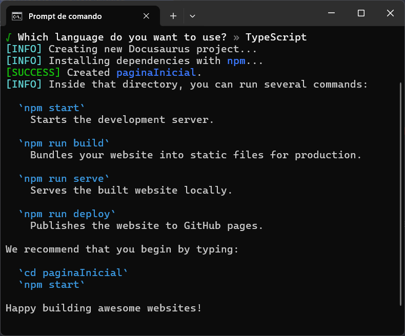
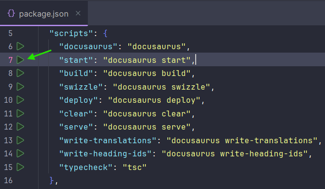
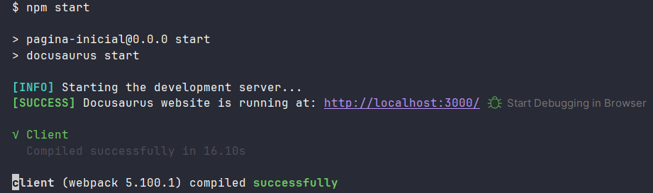
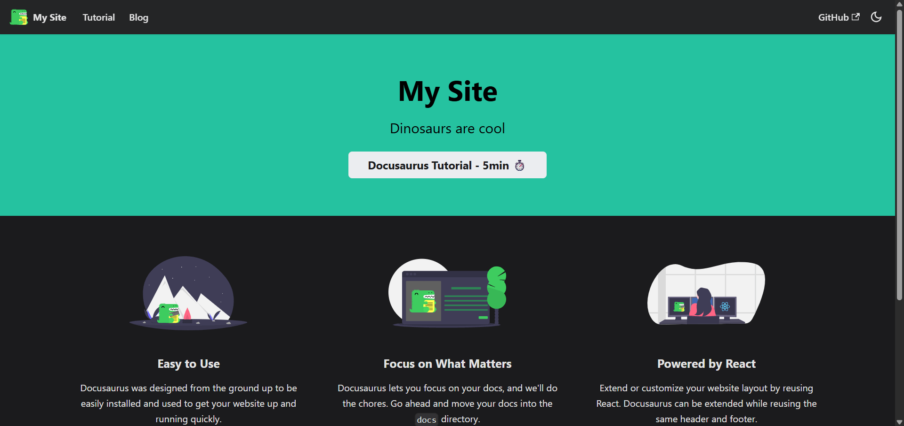

## É o Docusaurus!

Antes de começar a falar dele, vamos à definição segundo a própria [documentação](https://docusaurus.io/docs):

> 🧐 O Docusaurus é um gerador de sites estáticos. Ele cria um SPA (Single Page Application) com navegação rápida do lado do cliente, aproveitando todo o poder do React para tornar seu site interativo. Ele oferece recursos de documentação prontos para uso, mas pode ser usado para criar qualquer tipo de site (site pessoal, produto, blog, landing pages de marketing, etc.).
>
> — Documentação do Docusaurus (traduzida por mim)

<!-- truncate -->


## Docusaurus, eu escolho você!

Agora que nosso Pokémon foi devidamente apresentado, quem olhar no rodapé desta página vai perceber que o **OCDV** é construído com Docusaurus.

Eu poderia usar um CMS de prateleira? Poderia! Talvez até devesse... Mas que graça teria só escrever os posts, sem ao menos ~sofrer um pouco antes~ aprender uma ferramenta nova?

Ok, eu já tinha a ideia de gerar páginas estáticas. Mas por que o Docusaurus e não ~o Charmander ou o Squirtle~ outro gerador?

Primeiro, porque nas minhas pesquisas ele sempre aparecia nas listas de top 10. Segundo, porque eu já usava o Docusaurus para fazer documentação no trabalho, nada mais justo do que usar uma ferramenta que já conheço minimamente e que é útil no meu dia a dia.

Para argumentos mais técnicos sobre o uso do Docusaurus, tem essa [sessão da documentação oficial](https://docusaurus.io/docs#comparison-with-other-tools "Comparison with other tools") que compara várias ferramentas.

## Início da Jornada

Quem quiser conhecer um pouco mais sobre esse gerador, vem comigo subir uma instância local e iniciar a jornada de criação de sites estáticos.

### Pré-requisitos

Não precisamos de muito para começar. Se não tiver instalado na sua máquina ainda, é necessário fazer o [download do Node.js](https://nodejs.org/pt/download/). Eu optei pelo binário pré-compilado, que é a forma mais simples para a instalação, e escolhi a última versão LTS (Long Term Support) disponível: **v22.17.0**.

Também é importante ter um editor ou IDE para editar os arquivos. Como javeiro, estou bem-acostumado com o IntelliJ, então baixei o [WebStorm](https://www.jetbrains.com/pt-br/webstorm/download), também da JetBrains, com uma interface familiar para mim. Mas isso é bem pessoal e fica a gosto do freguês. Outras boas opções são o [Sublime Text](https://www.sublimetext.com/) e o [VS Code](https://code.visualstudio.com/).

### Rodando Localmente

Para começar um novo projeto com Docusaurus, rode no terminal:

```bash
npx create-docusaurus@latest nome-projeto classic
```

:::info
- Como usamos aqui **`@latest`**, ele instalará a versão mais recente, que no meu caso foi a **3.8.1**;
- **`nome-projeto`** será o nome da pasta criada e do projeto em si;
- **`classic`** é o template básico fornecido.
:::

Também é possível passar o argumento de linguagem (JavaScript ou TypeScript). Se você não passar nenhum, ele perguntará. Eu não sou íntimo de nenhuma das duas, mas **TypeScript** faz mais meu **tipo**. 😋

A saída do comando será algo assim:



Logo de cara, ele apresenta os quatro comandos principais que mais usaremos. Outros scripts úteis podem ser conferidos [neste link](https://docusaurus.io/docs/cli).

Em seguida, entre na pasta do projeto e rode:

```bash
npm start
```

Outra forma é abrir o projeto no WebStorm, localizar o **`package.json`**, clicar no ícone de <spam class="text--success">play</spam> na linha do script **start** e clicar em **Run 'start'**:



Esse passo só é necessário na primeira vez. Depois, basta selecionar **start** e clicar no botão de <spam class="text--success">play</spam> no topo da IDE.

Se tudo der certo, você verá algo como:



O navegador padrão deve abrir a página local com um tutorial. Se não abrir, basta acessar manualmente o endereço exibido no terminal. Caso sua versão seja igual à minha (**3.8.1**), a página será esta:



:::tip

Para parar a execução:

- No terminal, pressione **Ctrl + C**
- No WebStorm, clique no ícone <spam class="text--danger">Stop</spam> no topo da IDE

:::

## Próximos Passos

Agora é só dar play no vídeo abaixo e explorar o tutorial que abriu anteriormente no navegador. Com uns 6 minutos você já entende o básico da ferramenta!

<div class="text--center"><iframe width="560" height="315" src="https://www.youtube.com/embed/fJ9rUzIMcZQ?si=qYCnlNvDeYfH6lLX" title="YouTube video player" allow="accelerometer; autoplay; clipboard-write; encrypted-media; gyroscope; picture-in-picture; web-share" referrerpolicy="strict-origin-when-cross-origin" allowfullscreen></iframe></div>

<p class="margin-top--md">Bons estudos e até a próxima publicação! 👋</p>

```js
return 20;
```
